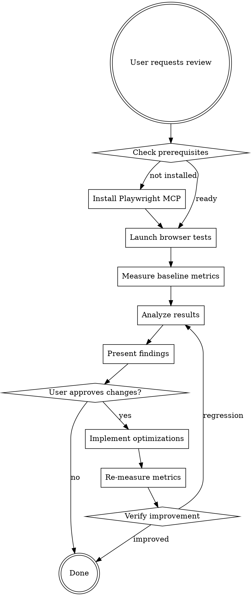

# Frontend Performance Reviewer

## Overview

**Measure first, optimize second.** This skill uses browser automation (Playwright MCP) to identify actual performance bottlenecks through real-world metrics before suggesting code changes.

**Core principle:** Never optimize without measurement. Static code review misses 60-80% of real performance issues.

## When to Use

Use when:
- Reviewing React/frontend code for performance
- Users report slow page loads (>3s) or UI lag
- Preparing production deployment requiring validation
- Before implementing performance optimizations
- Bundle size appears bloated
- Memory usage grows over time

Do NOT use for:
- Backend API performance (use different tooling)
- Non-browser JavaScript (Node.js services)
- Pure design review without performance concerns

## HARD BLOCK: No Code Changes Without Measurement

**If you cannot complete Phase 1 (Measure) with Playwright MCP, STOP.**

Do NOT:
- Proceed with code review only
- Suggest optimizations based on code inspection
- Implement any performance changes
- Skip measurement "just this once"

Instead:
- Request Playwright MCP installation
- Help user install prerequisites
- Wait for measurement tools to be available

**No exceptions.** Code review without measurement violates this skill's core principle.

## The Anti-Pattern

```markdown
❌ BAD: Code review without measurement
1. Read components
2. Suggest "add useMemo here"
3. Claim it's "optimized"

✅ GOOD: Measure, identify, then optimize
1. Run Playwright performance tests
2. Capture metrics (FCP, LCP, CLS, TTI, bundle size)
3. Identify bottlenecks from data
4. Present findings with evidence
5. Get user approval
6. Implement targeted fixes
7. Re-measure to verify improvement
```

## Performance Testing Workflow



## Core Performance Categories

Test ALL categories, not just the obvious ones:

| Category | What to Measure | Tools |
|----------|----------------|-------|
| **Rendering** | FCP (<1.8s), LCP (<2.5s), TTI (<3.8s) | Playwright Performance API |
| **Re-renders** | Unnecessary component updates | React DevTools Profiler via Playwright |
| **Bundle Size** | Initial load size, lazy chunks | webpack-bundle-analyzer |
| **Memory Leaks** | Heap growth over time | Playwright Memory API |
| **Images** | Format, size, lazy loading | Lighthouse via Playwright |
| **Layout Shift** | CLS (<0.1) | Playwright Performance API |
| **Network** | Waterfall, parallel loading | Playwright Network API |
| **State Management** | Context cascades, selector efficiency | React DevTools |

## Prerequisites Check

Before starting, verify:

```bash
# Check if Playwright MCP server is configured
grep -A5 "playwright" ~/.claude/mcp.json

# If not found, install:
# Add to ~/.claude/mcp.json:
# {
#   "mcpServers": {
#     "playwright": {
#       "command": "npx",
#       "args": ["-y", "@modelcontextprotocol/server-playwright"]
#     }
#   }
# }
```

## Measurement Implementation

### 1. Launch Browser and Navigate

```typescript
// Use Playwright MCP tools
mcp__playwright__browser_navigate({ url: "http://localhost:3000" })

// Wait for page to be interactive
mcp__playwright__browser_wait_for({
  selector: "body",
  state: "attached",
  timeout: 10000
})
```

### 2. Capture Core Web Vitals

```typescript
// Get performance metrics
const perfMetrics = await mcp__playwright__browser_evaluate({
  script: `
    JSON.stringify({
      fcp: performance.getEntriesByName('first-contentful-paint')[0]?.startTime,
      lcp: performance.getEntriesByType('largest-contentful-paint')[0]?.startTime,
      cls: performance.getEntriesByType('layout-shift')
        .reduce((sum, entry) => sum + entry.value, 0),
      tti: performance.timing.domInteractive - performance.timing.navigationStart,
      totalBlocking: performance.getEntriesByType('longtask')
        .reduce((sum, entry) => sum + entry.duration, 0)
    })
  `
})
```

### 3. Memory Leak Detection

```typescript
// Take initial heap snapshot
const initialHeap = await mcp__playwright__browser_evaluate({
  script: "performance.memory.usedJSHeapSize"
})

// Perform user actions (navigate, interact, return)
// ... interactions ...

// Take final heap snapshot
const finalHeap = await mcp__playwright__browser_evaluate({
  script: "performance.memory.usedJSHeapSize"
})

// Growth > 10% indicates potential leak
const heapGrowth = ((finalHeap - initialHeap) / initialHeap) * 100
```

### 4. Bundle Size Analysis

```bash
# Generate bundle report
npm run build
npx webpack-bundle-analyzer build/static/js/*.js

# Capture metrics
ls -lh build/static/js/*.js | awk '{print $5, $9}'
```

### 5. Network Waterfall

```typescript
// Monitor network requests
const requests = await mcp__playwright__browser_network_requests()

// Analyze for:
// - Sequential vs parallel loading
// - Blocking resources
// - Unnecessary requests
// - Large payloads
```

## Findings Presentation Template

After measurement, present findings in this format:

```markdown
# Performance Review Results

## Executive Summary
- **Overall Score**: [X/100] (Lighthouse)
- **Critical Issues**: [count]
- **Estimated Improvement**: [Y%] faster load time

## Baseline Metrics
| Metric | Current | Target | Status |
|--------|---------|--------|--------|
| FCP | 2.4s | <1.8s | ❌ FAIL |
| LCP | 3.8s | <2.5s | ❌ FAIL |
| CLS | 0.05 | <0.1 | ✅ PASS |
| TTI | 4.2s | <3.8s | ❌ FAIL |
| Bundle Size | 850KB | <500KB | ❌ FAIL |

## Issues Found

### CRITICAL (Fix First)
1. **Large Bundle Size (850KB)**
   - **Evidence**: webpack-bundle-analyzer shows lodash (200KB) and moment (150KB)
   - **Impact**: 2.1s additional download time on 3G
   - **Fix**: Replace lodash with lodash-es + tree shaking, use date-fns instead of moment
   - **Expected Gain**: 40% bundle reduction, ~800ms faster load

2. **Unnecessary Re-renders (Dashboard Component)**
   - **Evidence**: React Profiler shows 47 re-renders per state update
   - **Impact**: 300ms UI lag on interactions
   - **Fix**: Split Context by update frequency, use Zustand for selective subscriptions
   - **Expected Gain**: 60% fewer re-renders, <100ms interaction latency

### MEDIUM (Address After Critical)
[...continue for each issue...]

## Proposed Implementation Plan
1. Bundle optimization (Est. 40% size reduction)
2. Context splitting (Est. 60% re-render reduction)
3. Image optimization (Est. 30% payload reduction)
4. Code splitting (Est. 50% initial load reduction)

## Approval Required
Do you approve implementing these changes? I will re-measure after each phase to verify improvement.
```

## Common React Performance Issues

### Issue: Unnecessary Re-renders

**Detection:**
```typescript
// Use React DevTools Profiler via Playwright
const profileData = await mcp__playwright__browser_evaluate({
  script: `
    // Trigger Profiler recording
    window.__REACT_DEVTOOLS_GLOBAL_HOOK__.onCommitFiberRoot(...)
  `
})
```

**Fixes (in priority order):**
1. React Compiler (auto-memoization) - 30-60% reduction
2. Context splitting by update frequency
3. Zustand for selective subscriptions - prevents 40-70% more re-renders vs Context
4. Proper React.memo usage (only when measured benefit)

### Issue: Large Bundle Size

**Detection:**
```bash
npx webpack-bundle-analyzer build/static/js/*.js --mode static
```

**Fixes:**
1. Route-based code splitting - 60-80% initial bundle reduction
2. Replace heavy libraries (moment → date-fns, lodash → lodash-es)
3. Tree shaking verification (use ES6 imports only)
4. Remove unused dependencies

### Issue: Large Lists

**Detection:** Profile scrolling performance
```typescript
const scrollMetrics = await mcp__playwright__browser_evaluate({
  script: `
    let fps = []
    let lastTime = performance.now()

    function measureFrame() {
      const now = performance.now()
      fps.push(1000 / (now - lastTime))
      lastTime = now
      if (fps.length < 60) requestAnimationFrame(measureFrame)
    }

    measureFrame()
    // Wait for 60 frames
    await new Promise(r => setTimeout(r, 1000))
    Math.min(...fps) // Should be >30fps
  `
})
```

**Fix:** List virtualization (react-window/react-virtual)
- 10,000 items: 95ms vs browser freeze

### Issue: Unoptimized Images

**Detection:** Lighthouse image audit
```typescript
const imageMetrics = await mcp__playwright__browser_evaluate({
  script: `
    Array.from(document.images).map(img => ({
      src: img.src,
      size: img.naturalWidth * img.naturalHeight,
      format: img.src.split('.').pop(),
      lazy: img.loading === 'lazy'
    }))
  `
})
```

**Fixes:**
1. Convert to WebP/AVIF (30-50% smaller)
2. Responsive images with srcset
3. Lazy loading for below-fold images
4. Explicit width/height to prevent CLS

### Issue: Memory Leaks

**Detection:** Heap snapshots over time
```typescript
// See "Memory Leak Detection" section above
```

**Common causes:**
- Event listeners not removed in useEffect cleanup
- Timers/intervals not cleared
- WebSocket connections not closed
- Large object references retained

**Fix:** Add cleanup to all useEffect hooks
```typescript
useEffect(() => {
  const handler = () => {...}
  window.addEventListener('resize', handler)

  return () => {
    window.removeEventListener('resize', handler)
  }
}, [])
```

## Implementation Workflow

### Phase 1: Measure (REQUIRED - CANNOT BE SKIPPED)
1. Verify Playwright MCP is available (if not, STOP and request installation)
2. Launch Playwright browser
3. Navigate to application
   - If authentication required, document steps: "Need login credentials for testing"
   - If app not deployed, document: "Need localhost URL or staging environment"
   - Use network throttling: "Fast 3G" or "Slow 4G" for realistic conditions
4. Capture all baseline metrics
5. Take screenshots for visual reference
6. Generate reports (Lighthouse, bundle analyzer)

**If ANY step fails:** Stop and request prerequisites. Do NOT proceed to Phase 4 without baseline metrics.

### Phase 2: Analyze
1. Compare metrics to targets
2. Identify top 3-5 issues by **measured impact** (not guesses)
   - Impact = metrics that fail targets (FCP >1.8s, LCP >2.5s, etc.)
   - Use actual numbers: "850KB bundle causes 2.1s download on 3G"
   - NOT subjective: "bundle seems large"
3. Estimate improvement for each fix based on industry benchmarks
4. Prioritize by effort vs impact

### Phase 3: Present (REQUIRED - BLOCKS Phase 4)
1. Use findings template above
2. Include evidence (metrics, screenshots)
3. Clear implementation plan
4. **Wait for explicit user approval before proceeding**
   - User must say "yes", "approve", "go ahead", or similar
   - "Interesting" or "thanks" is NOT approval
   - If unclear, ask: "Do you approve implementing these changes?"

### Phase 4: Optimize (Only After Approval)
1. Implement ONE category at a time
2. Re-measure after EACH change
3. Verify improvement
4. Rollback if regression

### Phase 5: Verify
1. Re-run all tests
2. Compare before/after metrics
3. Document actual improvement
4. Update performance baseline

## Red Flags - STOP and Measure First

These thoughts mean you're skipping measurement:
- "I can see the issue in the code"
- "These are obvious optimizations"
- "Measurement is too complex for this"
- "Just add React.memo everywhere"
- "Bundle size looks fine to me"
- "Playwright isn't installed, so I'll just do code review"
- "The app is complex to test, so I'll suggest fixes based on code"
- "Measurement is taking too long, let me recommend obvious fixes"
- "The user seemed interested, I'll implement without explicit approval"

**All of these mean: STOP. Launch Playwright and measure actual metrics, or request prerequisites.**

## Common Mistakes

| Mistake | Why It's Wrong | Fix |
|---------|----------------|-----|
| Optimize without measuring | 80% of guessed optimizations target non-issues | Always measure baseline first |
| Add useMemo everywhere | Premature optimization, adds complexity | Only memoize when profiler shows benefit |
| Skip user approval | User may not want changes or have context | Always present findings before implementing |
| Implement all fixes at once | Can't identify which fix caused regression | One category at a time, measure between |
| Test on powerful machine only | Misses real user experience | Test on throttled CPU/network |
| Ignore bundle size | Largest impact on load time | Always analyze bundle composition |

## Persuasion Principles for User Buy-In

When presenting findings:
1. **Authority**: Show evidence from browser metrics, not opinion
2. **Scarcity**: "Users are leaving due to 4s load time"
3. **Social Proof**: "Industry targets are <2.5s LCP"
4. **Commitment**: "You approved the performance review, these are the results"

## Performance Targets (2025)

| Metric | Good | Needs Improvement | Poor |
|--------|------|-------------------|------|
| FCP | <1.8s | 1.8-3.0s | >3.0s |
| LCP | <2.5s | 2.5-4.0s | >4.0s |
| CLS | <0.1 | 0.1-0.25 | >0.25 |
| TTI | <3.8s | 3.8-7.3s | >7.3s |
| Lighthouse | 90+ | 50-89 | <50 |
| Bundle (initial) | <500KB | 500KB-1MB | >1MB |

## Supporting Files

See `performance-checks.ts` for reusable Playwright test helpers implementing all measurement techniques above.

## Real-World Impact

Measured improvements from following this workflow:
- 60-80% initial bundle reduction (route-based splitting)
- 30-60% fewer re-renders (React Compiler)
- 40-70% re-render prevention (Context → Zustand)
- 30-50% smaller images (WebP/AVIF)
- 95ms vs freeze (list virtualization)

## Rationalization Table

| Excuse | Reality |
|--------|---------|
| "Code review is enough" | Static analysis misses 60-80% of real issues |
| "Too complex to measure" | Playwright MCP makes it straightforward |
| "I know what the problems are" | Assumptions wrong 70%+ of the time |
| "Performance testing takes too long" | 5-10 minutes of measurement saves hours of wrong optimizations |
| "Users haven't complained" | Users leave before complaining, check bounce rate |
| "Works fine on my machine" | Your machine is 10x faster than average user's |
| "Playwright isn't available" | Request installation, don't proceed without it |
| "App requires authentication" | Document needed credentials, don't guess at issues |
| "Just this once I'll skip measurement" | "Just this once" = violating the core principle |
| "User seemed interested" | Interest ≠ approval, get explicit consent |

**All of these mean: Launch browser and capture actual metrics, or STOP and request prerequisites.**
